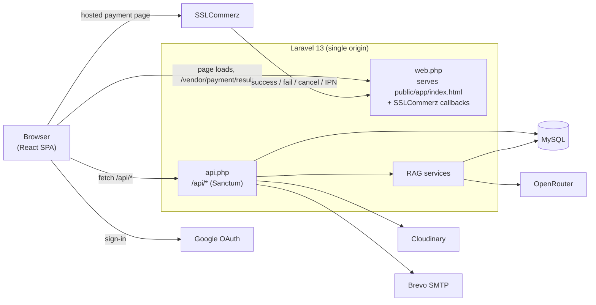
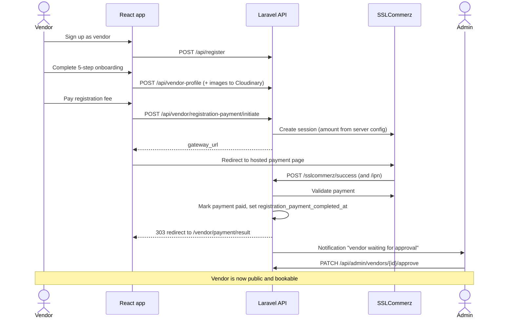
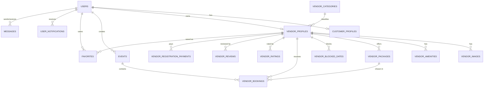

# Eventree

**A one-stop event planning marketplace that connects customers with event service vendors.**

🌐 **Live Demo:** http://eventree.austattendance.online

Customers plan events, discover vendors (venues, caterers, decorators, photographers, planners, entertainers), chat with them, and send booking requests. Vendors onboard, pay a one-time registration fee, get approved by an admin, and then manage their profile, packages, availability, and incoming bookings. Admins oversee the whole platform. An AI assistant answers questions about the platform and live vendor data.

> Built as a **CSE 3100** course project. Prices are in Bangladeshi Taka (BDT, ৳).

---

## Table of contents

- [Features](#features)
- [Tech stack](#tech-stack)
- [Architecture](#architecture)
- [Repository structure](#repository-structure)
- [Getting started](#getting-started)
- [Environment variables](#environment-variables)
- [Core business rules](#core-business-rules)
- [Vendor onboarding and payment flow](#vendor-onboarding-and-payment-flow)
- [AI assistant (RAG chatbot)](#ai-assistant-rag-chatbot)
- [API reference](#api-reference)
- [Data model](#data-model)
- [Testing](#testing)
- [Deployment (CI/CD)](#deployment-cicd)
- [Git workflow](#git-workflow)

---

## Features

### Customers
- Sign up with email/phone and password, or with **Google**; email verification and password reset flows
- **Browse vendors** with filters for category (multi-select), maximum price, minimum rating, and availability date, plus sorting
- **Vendor detail pages**: cover and portfolio gallery, about, amenities, pricing packages, availability calendar, ratings and reviews
- **Favorites** and profile sharing
- **My Events** workspace: create, edit, and delete events (title, type, date, location, guest count, budget), and mark them complete
- **Booking requests** to vendors against a specific event, with an optional package choice
- **Real-time-style messaging** with vendors (REST-based conversations)
- **Invoice** per event for accepted bookings, viewable and downloadable as **PDF**
- In-app **notifications** (bell) for booking accepted/rejected
- Profile page with avatar upload

### Vendors
- 5-step **onboarding wizard**: business info, location and contact, highlights and images, services and packages (up to 3), review
- One-time **registration fee** paid through **SSLCommerz**
- Dashboard with analytics (revenue, confirmed bookings, pending requests, events completed)
- **Business profile** editor: cover image, portfolio gallery, amenities, packages
- **Bookings** management: accept, reject, or complete requests
- **Availability** calendar: block dates manually
- **Messages** inbox with customers

### Admins
- Dashboard: revenue chart, payment alerts, vendor watchlist
- **Customers**: list and delete
- **Vendors**: list, **approve**, and delete (vendors are only public and bookable once approved)
- **Bookings**, **Payments**, and **Reports** views

### Platform
- Role-based access control (`customer`, `vendor`, `admin`) enforced on both the API and the React router
- Transactional emails (welcome, verify email, reset password, event created) via SMTP (Brevo)
- Image hosting on **Cloudinary**
- **RAG chatbot** that answers from a knowledge PDF and live vendor database queries

---

## Tech stack

| Layer | Technology |
| --- | --- |
| **Frontend** | React 19, Vite 8, React Router 7, Tailwind CSS 4, Framer Motion, Recharts, Lucide / React Icons, `@react-oauth/google` |
| **Backend** | PHP ^8.3 (CI runs 8.4), Laravel 13, Laravel Sanctum (token auth), Laravel Socialite (Google), `barryvdh/laravel-dompdf` (invoices), `smalot/pdfparser` (knowledge ingestion) |
| **Database** | MySQL 8 (SQLite in-memory for tests) |
| **Payments** | SSLCommerz via `raziul/sslcommerz-laravel` (sandbox by default) |
| **Media** | Cloudinary (`cloudinary/cloudinary_php`) |
| **Email** | SMTP (Brevo relay) |
| **AI** | OpenRouter (chat completions with tool calling + embeddings) |
| **Tooling** | npm workspaces monorepo, Docker Compose, GitHub Actions, PHPUnit 12, Laravel Pint, ESLint 10 |

---

## Architecture

Eventree is a **monorepo with a single deployable**. The React app is built into Laravel's `public/app/` directory, and Laravel serves both the JSON API and the SPA from one origin. That means no CORS configuration, and the frontend always calls relative `/api/...` URLs.



Key points:

- **SPA fallback.** `routes/web.php` returns `public/app/index.html` for every path except `api/*`, `sslcommerz/*`, and `up`, so React Router can handle deep links and refreshes.
- **Auth.** Sanctum personal access tokens. The frontend stores the token and user in `localStorage` (`eventree_token`, `eventree_user`) and sends `Authorization: Bearer <token>`.
- **Server is the source of truth.** Vendor payment and onboarding state is cached in `localStorage` for UI convenience only; the app re-syncs it from `GET /api/vendor/registration-status`.

---

## Repository structure

```text
Eventree/
├── package.json                  # npm workspaces root (packages/*) + dev scripts
├── docker-compose.yml            # MySQL + Laravel + Vite dev containers
├── .github/workflows/deploy.yml  # CI/CD: build + scp + migrate on the VPS
├── docs/                         # Course deployment guideline
└── packages/
    ├── backend/                  # Laravel 13 API
    │   ├── app/
    │   │   ├── Console/Commands/IngestKnowledge.php   # php artisan rag:ingest
    │   │   ├── Http/Controllers/  # Auth, Events, Vendor*, Admin, Payment, Rag, ...
    │   │   ├── Http/Middleware/EnsureAdmin.php
    │   │   ├── Mail/              # Welcome, VerifyEmail, ResetPassword, EventCreated
    │   │   ├── Models/
    │   │   └── Services/          # NotificationService, Rag/*
    │   ├── config/                # eventree.php, sslcommerz.php, services.php, ...
    │   ├── database/              # migrations, factories, seeders
    │   ├── resources/views/       # email templates + invoice PDF template
    │   ├── routes/                # api.php, web.php
    │   ├── storage/app/knowledge.pdf   # chatbot knowledge base
    │   └── tests/                 # Feature tests
    └── frontend/                 # React + Vite SPA
        └── src/
            ├── api/, services/    # fetch wrappers per resource
            ├── context/AuthContext.jsx
            ├── components/        # Navbar, Footer, Auth/*, RagChatbot, Notifications, ...
            ├── pages/             # Landing, Login, Signup, ClientLanding (browse),
            │                      # VendorDetails, MyEvents, VendorLanding (dashboard),
            │                      # VendorOnboarding, VendorPayment, AdminDashboard, ...
            └── utils/             # currency (BDT), events, storage helpers
```

### Frontend routes

| Path | Access | Page |
| --- | --- | --- |
| `/` | Public (admins redirect to `/admin`; unfinished vendors redirect to onboarding/payment) | Global landing page |
| `/login`, `/signup`, `/forgot-password`, `/reset-password`, `/verify-email` | Public | Auth pages |
| `/browse-vendor`, `/browse-vendor/:id` | Public | Vendor marketplace and vendor details |
| `/browse-vendor/:id/booking-request-sent` | Public | Booking confirmation |
| `/profile` | Logged-in | Profile |
| `/my-events`, `/favorites` | Customer | Event workspace, saved vendors |
| `/vendor` | Vendor (post-onboarding and payment) | Vendor dashboard |
| `/vendor/onboarding`, `/vendor/payment`, `/vendor/payment/result` | Vendor | Onboarding wizard, fee payment, gateway result |
| `/admin/*` | Admin | Dashboard, customers, vendors, bookings, payments, reports |

---

## Getting started

### Prerequisites

- PHP 8.3+ with extensions: `mbstring`, `bcmath`, `ctype`, `fileinfo`, `gd`, `intl`, `pdo_mysql`, `zip`
- Composer 2
- Node.js 22+ and npm
- MySQL 8 (or Docker)

### Option A: Run locally (single origin, mirrors production)

```bash
# 1. Install JS dependencies (root workspaces) and PHP dependencies
npm install
cd packages/backend && composer install

# 2. Configure the backend
cp .env.example .env
php artisan key:generate
# Edit .env: set DB_* credentials and the other values listed below

# 3. Create the database schema and seed baseline data
php artisan migrate --seed

# 4. Build the frontend into packages/backend/public/app
cd ../.. && npm run build:frontend

# 5. Start Laravel (serves the API and the built SPA)
npm run dev:backend        # php packages/backend/artisan serve  ->  http://localhost:8000
```

Create `packages/frontend/.env` from `.env.example` and set `VITE_GOOGLE_CLIENT_ID` **before** building if you want Google sign-in.

**Hot-reload frontend (optional):**

```bash
npm run dev:frontend       # Vite dev server on :5173, proxies /api -> http://127.0.0.1:8000
```

`vite.config.js` sets `base: '/app/'` so production assets resolve under `/app/`. If routes don't resolve under the dev server, use the single-origin flow above and rebuild when needed.

### Option B: Docker Compose

```bash
# packages/backend/.env  (copy from .env.example, then change these for Docker)
#   DB_HOST=db
#   DB_PORT=3306
#   DB_DATABASE=eventree
#   DB_USERNAME=root
#   DB_PASSWORD=root          # must match MYSQL_ROOT_PASSWORD in docker-compose.yml

docker compose up --build -d
docker compose exec backend php artisan key:generate
docker compose exec backend php artisan migrate --seed
```

| Service | Container | Port |
| --- | --- | --- |
| MySQL 8 | `eventree_db` | `127.0.0.1:3307` → 3306 |
| Laravel (`php artisan serve`) | `eventree_backend` | `8000` |
| Vite dev server | `eventree_frontend` | `5173` |

Things to know:
- The backend image does **not** run migrations on start, so run them yourself as shown.
- `.env.example` ships `DB_PASSWORD=rootpassword`, while Compose sets the MySQL root password to `root`. Make them match.
- Inside the frontend container, the Vite proxy target `127.0.0.1:8000` points at the container itself, not the backend. For a working UI, build the frontend and use the backend on `:8000`, or run Vite on your host.

### Seed data

`php artisan migrate --seed` runs `DatabaseSeeder`, which creates:

| Seeder | Creates |
| --- | --- |
| `VendorCategorySeeder` | The six categories: Event Venues, Caterers, Decorations, Photography & Videography, Event Management, Music & Entertainment |
| `AdminUserSeeder` | Admin account `admin@eventree.test` (password is in the seeder; **change it outside local development**) |

Optional demo marketplace (14 approved, paid demo vendors, two per category, with images from `frontend/public/demo-vendors`):

```bash
php artisan db:seed --class=DemoVendorSeeder
```

Demo vendor logins look like `eventvenue1@eventree.test`; the password is defined in `DemoVendorSeeder`.

### Build the chatbot knowledge base

```bash
php artisan rag:ingest            # reads storage/app/knowledge.pdf, embeds it, stores it in MySQL
php artisan rag:ingest app/other.pdf   # optional: a different path relative to storage/
```

Requires `OPENROUTER_API_KEY`. The command is idempotent: it truncates and rebuilds the `knowledge_chunks` table.

### Useful scripts

| Command | Where | What it does |
| --- | --- | --- |
| `npm run dev:frontend` | root | Vite dev server |
| `npm run dev:backend` | root | `php artisan serve` |
| `npm run build:frontend` | root | Build SPA into `packages/backend/public/app` |
| `npm run lint` | `packages/frontend` | ESLint |
| `composer test` | `packages/backend` | Clear config cache and run PHPUnit |
| `./vendor/bin/pint` | `packages/backend` | Format PHP code |

---

## Environment variables

### Backend (`packages/backend/.env`)

`.env.example` covers the Laravel defaults. The application also reads the variables below, so add them to your `.env`.

| Variable | Purpose |
| --- | --- |
| `APP_URL` | Backend base URL (`http://localhost:8000` locally) |
| `FRONTEND_URL` | Where the backend redirects users after email verification and payment callbacks |
| `DB_CONNECTION`, `DB_HOST`, `DB_PORT`, `DB_DATABASE`, `DB_USERNAME`, `DB_PASSWORD` | MySQL connection (use `127.0.0.1`, not `localhost`, on the VPS) |
| `QUEUE_CONNECTION` | `sync` runs queued mail immediately. With `database`, run `php artisan queue:work` |
| `MAIL_MAILER`, `MAIL_HOST`, `MAIL_PORT`, `MAIL_USERNAME`, `MAIL_PASSWORD`, `MAIL_ENCRYPTION`, `MAIL_FROM_ADDRESS`, `MAIL_FROM_NAME` | SMTP (Brevo relay is `smtp-relay.brevo.com:587`, TLS). `MAIL_MAILER=log` writes mail to the log |
| `GOOGLE_CLIENT_ID`, `GOOGLE_CLIENT_SECRET`, `GOOGLE_REDIRECT_URI` | Google sign-in (Socialite) |
| `CLOUDINARY_URL` | `cloudinary://<api_key>:<api_secret>@<cloud_name>` for vendor image uploads |
| `SSLC_SANDBOX` | `true` for the SSLCommerz sandbox (default) |
| `SSLC_STORE_ID`, `SSLC_STORE_PASSWORD`, `SSLC_STORE_CURRENCY` | SSLCommerz credentials and currency (default `BDT`) |
| `VENDOR_REGISTRATION_FEE` | One-time vendor fee (default `500`) |
| `OPENROUTER_API_KEY` | OpenRouter key |
| `OPENROUTER_MODEL` | Chat model slug (required for the chatbot, no default) |
| `OPENROUTER_EMBEDDING_MODEL` | Embedding model (default `nvidia/llama-nemotron-embed-vl-1b-v2:free`) |

### Frontend (`packages/frontend/.env`)

| Variable | Purpose |
| --- | --- |
| `VITE_GOOGLE_CLIENT_ID` | Google OAuth client ID used by `@react-oauth/google` (baked in at build time) |

> **Never commit real secrets.** `.env` files are git-ignored. Keep `.env.example` files to placeholder values only.

---

## Core business rules

These are enforced server-side (mostly inside database transactions with row locks).

**Events**
- Only customers can create events. The date must be today or later, and guests must be at least 1.
- Once a booking request exists for an event, its **date, type, guests, and location are locked**.
- Completed (`Past`) events cannot be edited, and events with booking history cannot be deleted.
- Completing an event marks accepted bookings `completed` and rejects remaining `pending` ones.
- Event statuses: `Planning` → `Confirmed` (when a vendor is accepted) → `Past` (when completed).

**Bookings**
- Booking details (date, type, guests) are always copied from the event in the database, never trusted from the request.
- A vendor must be **onboarded, paid, and admin-approved** to receive requests.
- An event can have only **one accepted/completed vendor per category**, and you can't send duplicate active requests to the same vendor for the same event.
- Requests for a vendor's **blocked dates** are rejected.
- A `pending` request does **not** reserve a date; an `accepted` booking does (a unique `active_date_key` guards against double booking).
- Accepting a request automatically rejects competing `pending` requests (same event and category, plus that vendor's other pending requests on the same date) and notifies the affected users.
- Booking statuses: `pending`, `accepted`, `rejected`, `completed`.

**Vendors**
- A vendor profile becomes public only when `onboarding_completed_at`, `registration_payment_completed_at`, and `admin_approved_at` are all set.
- Up to 3 packages per vendor.

**Payments**
- The registration fee amount comes from server config, never from the request.
- Payment is marked complete **only** after the SSLCommerz callback is re-validated against SSLCommerz's validation API using the amount and currency stored in our database. The success redirect and the IPN may race, so settlement is idempotent.

---

## Vendor onboarding and payment flow



---

## AI assistant (RAG chatbot)

A floating chat widget (visible to logged-in customers and vendors) calls `POST /api/agent/chat`. The backend runs a small **tool-calling loop** (max 5 steps) against an OpenRouter chat model:

| Tool | Source | Used for |
| --- | --- | --- |
| `search_vendors` | Live MySQL query (`VendorKnowledgeService`): filters by rating, category, city, amenity, vendor name; returns up to 10 vendors with packages and ratings | Vendor questions |
| `search_knowledge` | Embeds the question and returns the top 3 chunks of `storage/app/knowledge.pdf` by cosine similarity (`KnowledgeSearchService`) | Platform questions, policies, how things work |

Design notes:
- The system prompt restricts scope to Eventree topics and forbids inventing vendors, prices, ratings, or policies.
- Ingestion (`rag:ingest`) parses the PDF page by page, splits into overlapping ~800-character chunks, embeds them in batches of 32, and stores vectors as JSON in MySQL. Retrieval computes cosine similarity in PHP, which is fine for a small knowledge base.
- Request history is capped at 8 messages.

---

## API reference

All routes are under `/api`. **Auth** column: *Public* needs no token, *Bearer* needs a Sanctum token, *Customer/Vendor/Admin* additionally require that role.

### Auth and account

| Method | Endpoint | Auth | Description |
| --- | --- | --- | --- |
| `POST` | `/register` | Public | Register as `customer` or `vendor` |
| `POST` | `/login` | Public | Login with email **or** phone (`identifier`) and password |
| `POST` | `/auth/google/callback` | Public | Sign in with a Google access token (new users must pass `role`) |
| `POST` | `/logout` | Bearer | Revoke the current token |
| `GET` | `/user` | Bearer | Current user |
| `POST` | `/forgot-password`, `/reset-password` | Public | Password reset flow |
| `GET` | `/email/verify/{id}/{hash}` | Signed URL | Verify email, then redirect to the frontend |
| `POST` | `/email/verification-notification` | Bearer | Resend verification (throttled 6/min) |
| `GET`, `PUT` | `/customer-profile` | Bearer | Customer profile |
| `GET` | `/health` | Public | Status and deployed commit SHA |

### Marketplace (public)

| Method | Endpoint | Description |
| --- | --- | --- |
| `GET` | `/vendor-categories` | Category list |
| `GET` | `/vendors` | Approved vendors. Query: `category`, `max_price`, `availability_date` |
| `GET` | `/vendors/{id}` | Vendor details |
| `GET` | `/vendors/{id}/availability` | Blocked and booked dates |

### Customer

| Method | Endpoint | Description |
| --- | --- | --- |
| `GET`, `POST`, `GET`, `PUT`, `DELETE` | `/events`, `/events/{id}` | Event CRUD (API resource) |
| `POST` | `/events/{id}/complete` | Complete an event |
| `GET` | `/events/{id}/invoice` | Invoice data for accepted bookings |
| `GET` | `/events/{id}/invoice/download` | Invoice as PDF |
| `POST` | `/bookings` | Send a booking request (`vendor_id`, `event_id`, optional `package_id`) |
| `GET`, `POST` | `/favorites`, `/favorites/toggle` | Saved vendors |
| `POST` | `/vendors/{id}/rating` | Rate a vendor (1 to 5) |
| `POST` | `/vendors/{id}/reviews` | Write a review |
| `PUT`, `DELETE` | `/reviews/{id}` | Edit or delete a review |
| `GET`, `POST` | `/messages/vendors/{vendorProfile}` | Conversation with a vendor |

### Vendor

| Method | Endpoint | Description |
| --- | --- | --- |
| `POST`, `GET`, `PUT` | `/vendor-profile` | Create, read, update business profile |
| `POST`, `PUT` | `/vendor-profile/cover-image`, `/vendor-profile/cover-image/{image}` | Upload or select cover image |
| `POST`, `DELETE` | `/vendor-profile/portfolio-images`, `/vendor-profile/images/{image}` | Manage portfolio images |
| `POST` | `/vendor-details` | Save amenities and packages (max 3) |
| `GET` | `/vendor/dashboard` | Analytics |
| `GET`, `PATCH` | `/vendor/bookings`, `/vendor/bookings/{id}/status` | List bookings, accept / reject / complete |
| `GET`, `PUT` | `/vendor/availability` | Manage blocked dates |
| `GET` | `/vendor/registration-status` | Onboarding and payment state |
| `POST` | `/vendor/registration-payment/initiate` | Start SSLCommerz session (throttled 10/min) |
| `GET`, `POST` | `/vendor/messages`, `/vendor/messages/{customerId}` | Inbox and replies |

### Notifications (any logged-in user)

| Method | Endpoint | Description |
| --- | --- | --- |
| `GET` | `/notifications`, `/notifications/summary` | List and unread summary |
| `PATCH` | `/notifications/{id}/read` | Mark one read |
| `POST` | `/notifications/read-all` | Mark all read |

### Admin (`/admin/*`, role `admin`)

| Method | Endpoint | Description |
| --- | --- | --- |
| `GET` | `/admin/dashboard`, `/admin/reports` | Overview and reports |
| `GET`, `DELETE` | `/admin/customers`, `/admin/customers/{id}` | List and delete customers |
| `GET`, `PATCH`, `DELETE` | `/admin/vendors`, `/admin/vendors/{id}/approve`, `/admin/vendors/{id}` | List, approve, delete vendors |
| `GET` | `/admin/bookings`, `/admin/payments` | Bookings and payments |

### AI assistant

| Method | Endpoint | Auth | Description |
| --- | --- | --- | --- |
| `POST` | `/agent/chat` | Public route | Body: `question`, optional `history[]` of `{role, content}` |

### Payment gateway callbacks (web routes, not under `/api`)

`POST /sslcommerz/success`, `/sslcommerz/failure`, `/sslcommerz/cancel`, `/sslcommerz/ipn`. These are CSRF-exempt, and every success is re-validated server-side.

---

## Data model



| Table | Highlights |
| --- | --- |
| `users` | `role` (`customer`/`vendor`/`admin`), `phone`, `google_id`, nullable password for Google users |
| `vendor_profiles` | Business details plus `onboarding_completed_at`, `registration_payment_completed_at`, `admin_approved_at`, `cover_image_id` |
| `vendor_bookings` | `status` enum, denormalized package name/price, unique `active_date_key` for accepted bookings |
| `events` | `status` enum `Planning`/`Confirmed`/`Past`, `completed_at`, guests, budget |
| `vendor_registration_payments` | Gateway transaction record (`tran_id`, `status`, `val_id`, `paid_at`, ...) |
| `knowledge_chunks` | Chatbot text chunks and their embedding vectors (JSON) |
| `personal_access_tokens`, `sessions`, `cache`, `jobs` | Framework tables |

---

## Testing

```bash
cd packages/backend
composer test          # or: php artisan test
```

Tests run against **in-memory SQLite** with array mail, cache, and session drivers, so no database setup is needed. The feature suite covers:

| File | Covers |
| --- | --- |
| `EventBookingFlowTest` | Event ownership, DB-derived booking details, same-category acceptance rules, date reservation, duplicate and edit guards, completion, vendor ownership |
| `VendorMarketplaceFlowTest` | Public listings come from the DB, only fully-registered vendors are public, date reservation on acceptance, blocked dates |
| `VendorProfilePersistenceTest` | Profile, amenity, and package persistence; portfolio image as cover |
| `VendorRegistrationPaymentTest` | Valid / invalid / cancelled gateway callbacks, unknown transactions, no mock-complete endpoint |

Frontend linting: `cd packages/frontend && npm run lint`.

---

## Deployment (CI/CD)

Pushes to **`main`** (or a manual `workflow_dispatch`) trigger `.github/workflows/deploy.yml`:

1. Check out the repo and set up **PHP 8.4**
2. `composer install --no-dev --optimize-autoloader` in `packages/backend`
3. Set up **Node 22**, `npm ci` and `npm run build` in `packages/frontend` (with `VITE_GOOGLE_CLIENT_ID` from repository variables). The output lands in `packages/backend/public/app`
4. Verify `public/app/index.html` exists and write the commit SHA to `public/deploy-version.txt` (exposed by `GET /api/health`)
5. Create `release.tar.gz` of `packages/backend` (excluding `.git`, `node_modules`, `.env`)
6. Load the deploy key from the `SSH_PRIVATE_KEY` secret, then `scp` the archive to the VPS
7. Over SSH: unpack into `~/laravel`, fix permissions on `storage/` and `bootstrap/cache/`, run `php artisan migrate --force` and `php artisan optimize`, and delete the archive

Server-side conventions:
- nginx serves static files from `public/` and hands everything else to PHP-FPM; Laravel answers `/api/*` and falls back to the React `index.html`.
- Nothing is installed or built on the server, and no Node process or open port is needed for the UI.
- The production `.env` is created **once, by hand, on the server** and is never touched by the pipeline. After editing it, run `php artisan optimize`.
- The app connects to MySQL as its own limited user (never root), and tables come from migrations only.
- The pipeline does not run seeders. Run `php artisan db:seed --force` once on the server to create categories and the admin account.
- Set `SSLC_SANDBOX`, SSLCommerz credentials, and a publicly reachable URL for the IPN callback as needed.

**Required GitHub configuration:** secret `SSH_PRIVATE_KEY`; variable `VITE_GOOGLE_CLIENT_ID`.

The workflow does not currently run the PHPUnit suite or the frontend linter.

---

## Git workflow

- `main` is the deployed branch; `develop` is the integration branch.
- Work happens on short-lived branches named after issues, e.g. `feature/issue-134-payment`, `fix/issue-108-vendor-filters-and-confirmation-tick`, `refactor/issue-98-refactor-business-profile-component`, `chore/issue-48-monorepo-migration`.
- Never commit `.env`, vendor/`node_modules`, or `packages/backend/public/app` (built by CI).
